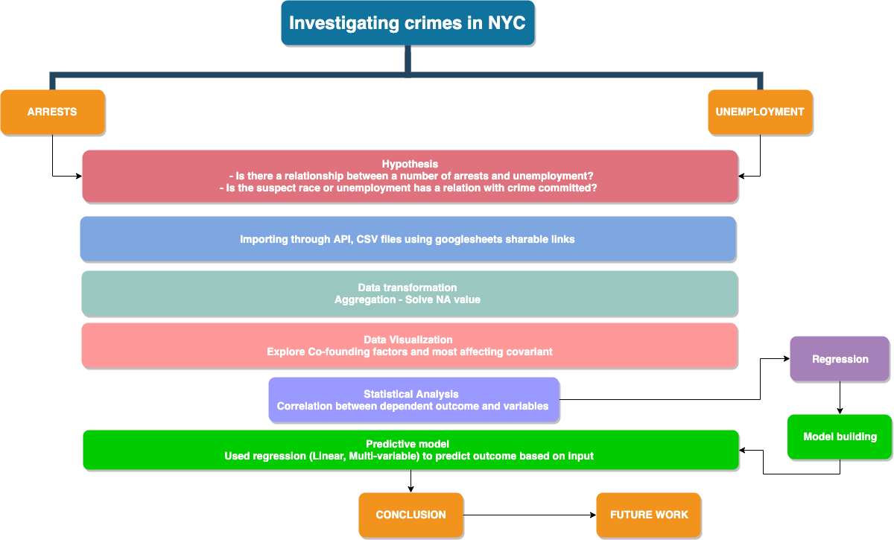

```{r setup, include=FALSE}
knitr::opts_chunk$set(echo = TRUE)
```

# A Socio-Economic Investigation into Crime

## Introduction

This project provided us with the opportunity of showcasing many of the skills we have learned throughout this course and of applying them to an investigation into datasets of our choosing. We narrowed our scope to a few datasets containing information on social economic information, namely unemployment and crime data in NYC. We hoped that this investigation would reveal valuable information that could be used to formulate policy proposals.	This project provided us with the opportunity of showcasing many of the skills we have learned throughout this course and of applying them to an investigation into datasets of our choosing. We narrowed our scope to a few datasets containing information on social economic information, namely unemployment crime data in NYC. We hoped that this investigation would reveal valuable information that could be used to formulate policy proposals.

We used the following workflow for each dataset:	

1. Data Import (API and .csv)	
2. Data Transformation (handling missing data, tidying)	
3. Data Exploration & Analysis (commentary, visualizations)	

We then merged the datasets to explore further and try to draw some final conslusions.

## Work flow-chart



## Sources

- [Unemployment data from the Department of Labor](https://www.labor.ny.gov/stats/nyc/)
- [NYPD Complaint Data Historic](https://data.cityofnewyork.us/Public-Safety/NYPD-Complaint-Data-Historic/qgea-i56i)

## Environment Setup

```{r environment setup, message=FALSE, warning=FALSE}
source("environment_setup.R", echo = T, prompt.echo = "", spaced = F)
```

# NYPD Arrests

## NYPD Arrests - Data Import via API

variable         | description
---------------- | -----------
`arrest_date`    | Exact date of arrest for the reported event.
`ofns_desc`      | Description of internal classification corresponding with KY code (more general category than PD description).
`arrest_boro`    | Borough of arrest. B(Bronx), S(Staten Island), K(Brooklyn), M(Manhattan), Q(Queens)
`age_group`      | Perpetrator’s age within a category.
`perp_sex`       | Perpetrator’s sex description.
`perp_race`      | Perpetrator’s race description.
`x_coord_cd`     | Midblock X-coordinate for New York State Plane Coordinate System, Long Island Zone, NAD 83, units feet (FIPS 3104).
`y_coord_cd`     | Midblock Y-coordinate for New York State Plane Coordinate System, Long Island Zone, NAD 83, units feet (FIPS 3104)
`latitude`       | Latitude coordinate for Global Coordinate System, WGS 1984, decimal degrees (EPSG 4326)
`longitude`      | Longitude coordinate for Global Coordinate System, WGS 1984, decimal degrees (EPSG 4326)

Load the data into R using the RSocrata API.

```{r arrests, warning=FALSE, message=FALSE}
source("arrests_dataset.R", echo = F, prompt.echo = "", spaced = F)
head(arrests_df, 10)
```

## NYPD Arrests - Data Transformation

```{r aggregation, message=FALSE, warning=FALSE}
murder_counts <- arrests_df %>%
  group_by(arrest_boro, year, perp_race) %>%
  dplyr::summarise(murder_counts = n()) %>%
  arrange(desc(year))
murder_counts
```

## NYPD Arrest - Data Exploration & Analysis

### Evolution of Crime 2014-2018

Let's study the evolution of crime over the period of interest (2014-2018).

```{r }
grouped_boro <- arrests_df %>% 
  group_by(year, arrest_boro) %>% 
  dplyr::summarize(count = n()) %>% 
  arrange(desc(count))
```

What the plot below reveals is that overall crime is decreasing for all boroughs of NYC. The data year over year is very similar, appearing to simply scale down over time. 

What we can note as suprising is the fact that total crime between Manhattan and Brooklyn is at fairly similar levels. Total crime is aggregated without accounting for different types of crime so we will further our investigation by dissecting crime per borough.

```{r}
ggplot(grouped_boro, aes(x = reorder(year, -count), y = count, fill = arrest_boro)) + 
  geom_bar(stat = 'identity', position = position_dodge()) +
  scale_y_continuous(labels=function(x) format(x, big.mark = ",", scientific = FALSE), breaks = seq(0,120000,10000)) +
  xlab("year") + ylab("total crime") + ggtitle("Crime by Borough Time Series") +
  scale_fill_brewer(palette="Blues") + theme_minimal()
```
```{r}
grouped_offenses <- arrests_df %>% 
  group_by(year, arrest_boro, ofns_desc) %>% 
  dplyr::summarize(count = n())
```
```{r}
t5 <- grouped_offenses %>% top_n(5)
```
```{r message=FALSE, warning=FALSE}
ggplot(t5, aes(x = reorder(arrest_boro, -count), y = count, fill=ofns_desc)) + 
  geom_bar(stat = 'identity', position = position_dodge()) +
  scale_y_continuous(labels=function(x) format(x, big.mark = ",", scientific = FALSE), breaks = seq(0,80000,5000)) +
  xlab("borough") + ylab("crime rate") + ggtitle("Most Common Crimes by Borough 2014-2018") +
  scale_fill_brewer(palette="Blues") + theme_minimal()
```

Perhaps we can comment on effective crime measures by looking at the least common crimes. **Fix this plot**

```{r message=FALSE, warning=FALSE}
ggplot(grouped_offenses %>% top_n(-25), aes(x = reorder(ofns_desc, -count), y = count)) + 
  geom_bar(stat = 'identity', fill= 'lightblue') + 
  coord_flip() + 
  xlab("offense") + ylab("count")  + ggtitle("Least Common Crimes 2014-2018") +
  theme(axis.text.x = element_text(size=10), axis.text.y = element_text(size=8))
```
```{r}
drugs <- arrests_df %>% filter(ofns_desc == 'DANGEROUS DRUGS') %>% group_by(year, arrest_boro) %>% dplyr::summarize(count = n())
```
```{r}
ggplot(drugs, aes(x = year, y = count, color = arrest_boro)) +
  geom_jitter() + 
  xlab("year") + ylab("count")  + ggtitle("Dangerous Drugs Crime by Bourough") +
  theme(axis.text.x = element_text(size=10), axis.text.y = element_text(size=8))
  
```
```{r message=FALSE, warning=FALSE}
ggplot(arrests_df, aes(x = age_group, fill = perp_sex)) + 
  geom_histogram(stat = "count", position=position_dodge()) +
  scale_fill_brewer(palette="Blues") + 
  xlab("age group") + ylab("count")  + ggtitle("Perpetrator Age Group and Gender Distribution") +
  scale_y_continuous(labels=function(x) format(x, big.mark = ",", scientific = FALSE), breaks = seq(0,7000000,100000))
```
```{r}
grouped_arrests <- arrests_df %>% group_by(year, arrest_boro, ofns_desc, age_group, perp_sex, perp_race) %>% 
  dplyr::summarize(count = n())
```

```{r map for arrests,echo=FALSE, fig.align='center', message=FALSE, warning=FALSE}
arrests_map <- arrests_df %>% filter(year == 2018)
singleicon <- makeIcon(iconUrl = "https://image.flaticon.com/icons/svg/1331/1331396.svg",
                       iconWidth = 45,
                       iconHeight = 45,
                       iconAnchorX = 0,
                       iconAnchorY = 0)
leaflet(arrests_map, width = '100%') %>% addTiles() %>% 
                                  addMarkers(lng = ~longitude, lat = ~latitude, 
                                             clusterOptions = markerClusterOptions(), 
                                             popup = paste("<b>Offense: </b>", arrests_map$ofns_desc, "<br/>",
                                                           "<b>Age Group: </b>", arrests_map$age_group, "<br/>",
                                                           "<b>Sex: </b>", arrests_map$perp_sex, "<br/>",
                                                           "<b>Race: </b>", arrests_map$perp_race),
                                             icon = singleicon)
```

# Labor Bureau

## Labor Bureau - Data Import via .csv

```{r dataset per boro, message=FALSE, warning=FALSE, paged.print=TRUE}
source("unemployed_dataset.R", echo = F, prompt.echo = "", spaced = F)
head(bronx)
head(queens)
head(brooklyn)
head(manhattan)
head(staten)
```

## Labor Bureau - Data Transformation

```{r clean unemployed, message=FALSE, warning=FALSE}
clean_table <- function (table) {
  table_content <- table %>%
    na.omit()
  colnames(table_content) = c("arrest_boro","year","month","labor_force","employed","unemployed","unemployment_rate")
  final_table <- table_content %>%
    select(arrest_boro, year, labor_force, employed, unemployed, unemployment_rate) 
  return(final_table)
}
bronx_income <- clean_table(bronx)
queens_income <- clean_table(queens)
brooklyn_income <- clean_table(brooklyn)
manhattan_income <- clean_table(manhattan)
staten_income <- clean_table(staten)
income_table <- Reduce(function(...) merge(..., all=T), list(bronx_income, queens_income, brooklyn_income, manhattan_income, staten_income))
income_table 
```

## Labor Bureau - Data Exploration & Analysis

```{r explore income by boro, message=FALSE, warning=FALSE}
theme_set(theme_bw())
ggplot(income_table, aes(x=arrest_boro, y=unemployment_rate)) + 
    geom_boxplot(main = "Different boxplot for uneployment rate in the 5 counties over years",
        ylab = "Unemployment rate %",	
        xlab = "",	
        col = "blue",	       
        border = "blue") +
facet_wrap(~year, scale="free") + 
  theme(axis.text.x = element_text(angle=60, vjust = 0.6)) 
```

```{r summarize avg unemployed, message=FALSE, warning=FALSE}
by_income <- income_table %>%
  group_by(arrest_boro, year) %>%
  dplyr::summarise(avg_unemployment_rate = max(unemployment_rate)) %>%
  arrange(desc(year))
by_income
```

# Combined Datasets

```{r merge murder and by income, message=FALSE, warning=FALSE}
merged <- Reduce(function(...) merge(..., all=T), list(murder_counts, by_income)) %>%
  na.omit() %>%
  arrange(desc(year))
merged
```
```{r normalize unemployed, message=FALSE, warning=FALSE}
# Data Prep
merged$boro <- rownames(merged)  # create new column for boro names
merged$unemployment_z <- round((merged$avg_unemployment_rate - mean(merged$avg_unemployment_rate))/sd(merged$avg_unemployment_rate), 2)  # compute normalized 
merged$unemployyment_type <- ifelse(merged$unemployment_z < 0, "below", "above")  # above / below avg flag
merged <- merged[order(merged$unemployment_z), ]  # sort
# merged$arrest_boro <- factor(merged$arrest_boro, levels = merged$arrest_boro)  # convert to factor to retain sorted order in plot.
merged$arrest_boro <- factor(merged$arrest_boro, levels = rev(unique(merged$arrest_boro)), ordered=TRUE)
# Diverging Barcharts
ggplot(merged, aes(x=`arrest_boro`, y=unemployment_z, label=unemployment_z)) + 
  geom_bar(stat='identity', aes(fill=unemployyment_type), width=.5)  +
  scale_fill_manual(name="Unemployment", 
                    labels = c("Above Average", "Below Average"), 
                    values = c("above"="#f8766d", "below"="#00ba38")) + 
  labs(subtitle="Normalised unemployment rate from 'merged'", 
       title= "Diverging Bars of unemployment rates in boro") + 
  coord_flip()
```
The Bronx seems to have the largest amount of unemployment rate which is above the average and in the same time it has the highest crime amongst other counties. 
```{r normalize crime, message=FALSE, warning=FALSE}
# Data Prep
merged$boro <- rownames(merged)  # create new column for boro names
merged$crime_z <- round((merged$murder_counts - mean(merged$murder_counts))/sd(merged$murder_counts), 2)  # compute normalized 
merged$murder_type <- ifelse(merged$crime_z < 0, "below", "above")  # above / below avg flag
merged <- merged[order(merged$crime_z), ]  # sort
# merged$arrest_boro <- factor(merged$arrest_boro, levels = merged$arrest_boro)  # convert to factor to retain sorted order in plot.
merged$arrest_boro <- factor(merged$arrest_boro, levels = rev(unique(merged$arrest_boro)), ordered=TRUE)
# Diverging Barcharts
ggplot(merged, aes(x=`arrest_boro`, y=crime_z, label=crime_z)) + 
  geom_bar(stat='identity', aes(fill=murder_type), width=.5)  +
  scale_fill_manual(name="Crimes", 
                    labels = c("Above Average", "Below Average"), 
                    values = c("above"="#f8766d", "below"="#00ba38")) + 
  labs(subtitle="Normalised murders'", 
       title= "Diverging Bars of number of murders per county") + 
  coord_flip()
```
As illustrated from the diverge bar that **Bronx** also has above average number of crimes
```{r density plot for age, message=FALSE, warning=FALSE}
theme_set(theme_classic())
# Plot
g <- ggplot(arrests_df, aes(arrest_boro))
g + geom_density(aes(fill=factor(age_group)), alpha=0.8) + 
    labs(title="Density plot", 
         subtitle="Number of crimes per boro per age group distribution",
         caption="Source: by_boro",
         x="Borough",
         fill="# crimes committed per age group") 
```
We can see that the 25-44 age category is the most age category for committing a crime. As also demonstrated, the **Bronx** seems to have the highest density of crimes am
```{r treemap for arrests, message=FALSE, warning=FALSE}
map <- murder_counts %>% filter(year == 2018)
treemap(map, #Your data frame object
        index=c("perp_race","arrest_boro"),  #A list of your categorical variables
        vSize = "murder_counts",  #This is your quantitative variable
        type="categorical", #Type sets the organization and color scheme of your treemap
        vColor = "arrest_boro", #Type sets the organization and color scheme of your treemap
        palette = "Set1",  #Select your color palette from the RColorBrewer presets or make your own.
        title="Crime distribution committed by different races - year 2018", #Customize your title
        fontsize.title = 14 #Change the font size of the title
        ) 
```

# Statistical Analysis & Modeling

```{r fetch complaindata 14-18, message=FALSE, warning=FALSE}
source("complain_dataset.R", echo = F, prompt.echo = "", spaced = F)
dat
```
```{r aggregate crime number, message=FALSE, warning=FALSE, paged.print=TRUE}
res <- dat %>%
  group_by(year, boro_nm) %>%
  filter(boro_nm != "") %>%
  dplyr::summarise(crimes = n()) 
res
```
```{r change to lowercase, message=FALSE, warning=FALSE, paged.print=TRUE}
by_crime <- res %>% mutate_if(is.character, str_to_lower) 
by_crime
```
```{r filter by unemployed, message=FALSE, warning=FALSE, paged.print=TRUE}
dat2 <- income_table
dat2$unemployed <- as.numeric(gsub(",", "", dat2$unemployed))
names(dat2)[1] <- "boro_nm"
subet <- dat2[c(1:2,5)]
by_unemployment <- subet %>%
  group_by(year, boro_nm) %>%
  dplyr::summarise(unemployed = round(mean(unemployed), 2)) %>%
  mutate_if(is.character, str_to_lower)
by_unemployment
```
```{r merge crime and unemployed, message=FALSE, warning=FALSE, paged.print=TRUE}
joined <- Reduce(function(...) merge(..., all=T), list(by_crime, by_unemployment)) %>%
  na.omit()
joined
```
To decide whether we can make a predictive model, the first step is to see if there appears to be a relationship between our predictor and response variables (in this case crimes and unemployed). Let’s do some exploratory data visualization. I’ll use the `ggpairs()` function from the `GGally package` to create a plot matrix to see how the variables relate to one another.

```{r correlation between crime and unemployed, message=FALSE, warning=FALSE}
ggpairs(data=joined, columns = 3:4, title="Crimes employed data")
```

There is an important aspect that correlation doesn't imply causation, so I will use the regression to see if I can use this variable as a predictor. 

```{r explore-unemployed as predictor, message=FALSE, warning=FALSE}
theme_set(theme_bw())  # pre-set the bw theme.
g <- ggplot(joined, aes(unemployed, crimes)) + 
  geom_jitter() +
  geom_smooth(method="lm") +
  labs(subtitle="Crimes per unemployed: crimes vs unemployed numbers", 
       y="Crimes", 
       x="Unemployed", 
       title="Scatterplot with overlapping points", 
       caption="Source: joined")
ggMarginal(g, type = "boxplot", fill="transparent")
```
```{r unemployed regression, message=FALSE, warning=FALSE}
m_unemployed <- lm(crimes ~ unemployed, data = joined)
summary(m_unemployed)
```
As shown by the simple linear regression, unemployment has an **R-squared  ~0.8** which makes it a better predictor for the crimes number. However, may be there are other factors that can be a confounding factors that increase crimes, for instance race or sex. 
Let's predict use linear prediction 
```{r}
predict(m_unemployed, data.frame(unemployed = 65783.31))
# 137472.7  actual 140338 from joined table
```
so close number; however, we need more variables to make the model predict better.
Now, I will inspect the other categorical independent variables associated with the number of commited murders.
```{r aggregate by category, message=FALSE, warning=FALSE}
by_cat <- dat %>%
  group_by(year, boro_nm, susp_age_group, susp_sex, susp_race) %>%
  filter(boro_nm != "" & susp_age_group !="") %>%
  dplyr::summarise(crimes = n()) 
by_cat
```
Categorize age-group preparing for dummy variables
```{r construct dummy variables, message=FALSE, warning=FALSE}
dummy_df <- by_cat
dummy_df$susp_age_group <- revalue(by_cat$susp_age_group, c("<18"="child", "18-24"="youth", "25-44"="adult", "45-64"="senior", "65+" = "senior")) 
dummy_df
```
Converting the independent variables into factors
```{r convert variables into factors, message=FALSE, warning=FALSE}
#function to categorize and indicate the cofounder variable
#
# function to categorise - dummy variables
filtered <- dummy_df %>%
  filter(susp_age_group %in% c("child", "youth", "adult", "senior")) 
## change to factor level
filtered$boro_nm <- as.factor(filtered$boro_nm)
filtered$susp_age_group <- as.factor(filtered$susp_age_group)
filtered$susp_sex <- as.factor(filtered$susp_sex)
filtered$susp_race <- as.factor(filtered$susp_race)
# contrasts(filtered$susp_race)
# reference variable is AMERICAN INDIAN/ALASKAN NATIVE, we can rereference by using relevel(var, ref = "new_ref")
```
```{r change reference to M, message=FALSE, warning=FALSE}
# contrasts(filtered$susp_sex) -> female is the reference
# filtered %>%
#   mutate(susp_race = relevel(susp_race, ref = "BLACK")) -> filtered
# contrasts(filtered$susp_race)  #- > now BLACK is the ref
m_race <- lm(crimes ~ susp_race, data = filtered)
summary(m_race) # no significance
```
```{r multi-reg for all variables-anova, message=FALSE, warning=FALSE}
m_all <- lm(crimes ~ susp_age_group + susp_sex + susp_race + boro_nm, data = filtered)
anova(m_all)
```
Taking other variables (susp_age_group, susp_sex, and boro_nm) into account, it can be seen that the categorical variable **boro_nm** the most significant variable **with lowest Sum Sq**.
```{r regression summary, warning=FALSE, message=FALSE}
summary(m_all)
```
It can be seen that being **Black** is significantly associated with an average increase of 1454 in crime compared to other races with **R-squared ~ 0.35**.
Having some information shown on plots would give a good idea as to which categorical variables are good predictive features and can be used to build a machine learning model.
Best plots for factor to factor variable comparison would be any of a jitter plot or heat map. I would use a jitter plot in this case for all of our factor-factor plots.
```{r exploratory analysis, warning=FALSE, message=FALSE}
ggplot(data = filtered, mapping = aes(x = susp_race, y = crimes)) + 
  geom_jitter(aes(colour = susp_race)) 
ggplot(data = filtered, mapping = aes(x = susp_sex, y = crimes)) + 
  geom_jitter(aes(colour = susp_sex)) 
ggplot(data = filtered, mapping = aes(x = susp_age_group, y = crimes)) + 
  geom_jitter(aes(colour = susp_age_group)) 
ggplot(data = filtered, mapping = aes(x = boro_nm, y = crimes)) + 
  geom_jitter(aes(colour = boro_nm)) + 
  theme(axis.text.x = element_text(angle=65, vjust=0.6))
```
